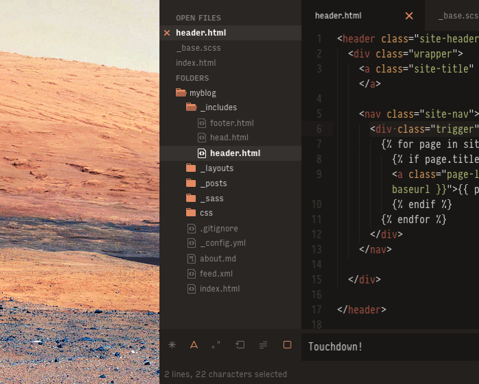
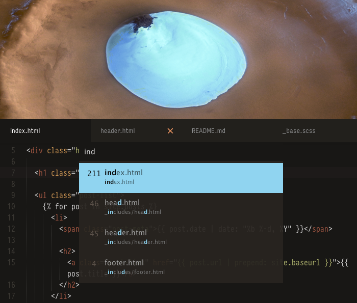
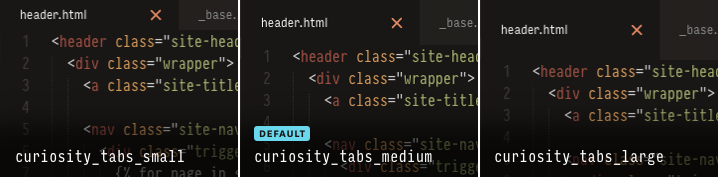
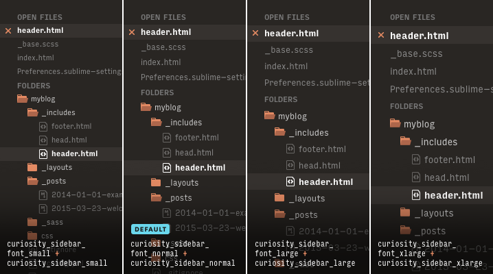
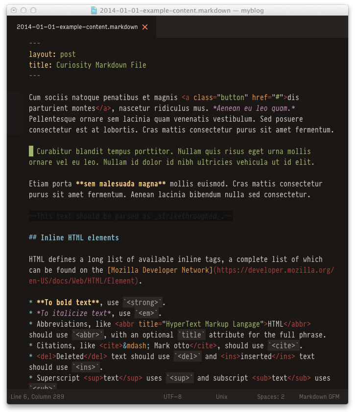

# Curiosity

[Curiosity](https://sublime.wbond.net/packages/Curiosity) is a simple dark theme for Sublime Text 3, inspired by Mars. It's basically a mixture of two popular themes: [Predawn](https://github.com/jamiewilson/predawn) and [Spacegray](https://github.com/kkga/spacegray).

Warmth from Predawn. Attitude from Spacegray.





<sub>Typeface used in code: [Pragmata Pro](http://www.fsd.it/fonts/pragmatapro.htm). UI Typeface: [Input Sans](http://input.fontbureau.com) • </sub>
<sub>First image → Mount Sharp, taken by NASA's Curiosity rover © [NASA/JPL-Caltech/MSSS](http://mars.jpl.nasa.gov/msl/) ([Source](http://mars.jpl.nasa.gov/msl/multimedia/images/?ImageID=4560)) · Second image → View of crater with water ice © [ESA/DLR/FU Berlin (G. Neukum)](http://www.esa.int/ESA) ([Source](http://www.esa.int/spaceinimages/Images/2005/07/Perspective_view_of_crater_with_water_ice_-_looking_east))

[View a screenshot of the entire theme](https://raw.githubusercontent.com/dmnplb/curiosity/master/screenshots/curiosity_theme.png)

***

## Features

* Custom [Base16 color scheme](https://github.com/chriskempson/base16) ([Default Dark](http://chriskempson.github.io/base16/#default))
* Solid support for Markdown, [YAML Front Matter](http://jekyllrb.com/docs/frontmatter/) block included <small>([Instructions](#markdown-guide))</small>
* Folder and file icons, designed by [Jamie Wilson](http://jamiewilson.io), inherited from [Predawn](https://github.com/jamiewilson/predawn) theme
* “Find & Replace” icons designed by [Gadzhi Kharkharov](http://kkga.me), inherited from [Spacegray](https://github.com/kkga/spacegray) theme
* Easy change of the UI typeface with the custom `CuriosityUI.Type` file <small>([Instructions](#ui-typeface))</small>
* Transparency and hover details
* Support for Retina displays

<sub>[Are you curious about the differences from Spacegray and Predawn?](#differences)</sub>

***

## How to Install

### Easy way: [Package Control](https://packagecontrol.io)
1. [Install Package Control](https://packagecontrol.io/installation)
2. Open Command Palette using the menu item `Tools → Command Palette...` (OS X → <kbd>Cmd</kbd>+<kbd>Shift</kbd>+<kbd>P</kbd> · Win/Linux → <kbd>Ctrl</kbd>+<kbd>Shift</kbd>+<kbd>P</kbd>)
3. Type and select `Package Control: Install Package`
4. Find `Theme - Curiosity` and hit <kbd>Enter</kbd>

### “Hacker” way: Git
1. Go to your Sublime Text `Packages` folder using the menu item `Preferences → Browse Packages...`
2. Clone the repository using this command:
```shell
git clone https://github.com/dmnplb/curiosity/ "Theme - Curiosity"
```

### Masochist way: Manual 
1. [Download the archive from Github](https://github.com/dmnplb/curiosity/archive/master.zip)
2. Unzip and rename the folder to `Theme - Curiosity`
3. Go to your Sublime Text `Packages` folder using the menu item `Preferences → Browse Packages...`
4. Copy `Theme - Curiosity` into `Packages` folder

***

## How to Activate
1. Open your “User Preferences” file using the menu item `Sublime Text → Preferences → Settings - User`
2. Add or replace your current theme settings with the code below, then save:

```json
{
  "theme": "Curiosity.sublime-theme",
  "color_scheme": "Packages/Theme - Curiosity/curiosity.base16.tmTheme"
}
```

Is your Sublime Text going nuts? That's okay. **Now you must restart Sublime Text to see the full theme in action**.

***

## Configuration

### <a name="ui-typeface"></a>UI Typeface

From the [Soda-Theme Wiki](https://github.com/buymeasoda/soda-theme/wiki/Theme-customisation):
> To begin customising an existing theme, create a new file in your `User` folder (located in the Sublime Text `Packages` directory) with the same name as the theme file you are extending. […] 
From this point, any valid theme rules you place in this file will automatically be applied by Sublime Text when the related theme is active.

#### Instructions
1. Download the **[CuriosityUI.Type](https://github.com/dmnplb/curiosity/blob/master/CuriosityUI.Type.sublime-theme)** file (`Save Link As…`). Take it from the cloned repository, if you followed the “Hacker” way.
2. Move the file in the `Packages/User` folder
3. If you prefer a custom type, edit all the font references (eg: Source Code instead of [PragmataPro](http://www.fsd.it/fonts/pragmatapro.htm)) using `Find&Replace` or <kbd>Cmd</kbd>+<kbd>D</kbd> (OSX) or <kbd>Ctrl</kbd>+<kbd>D</kbd> (Win/Linux) to select all the instances
4. Change its name to `Curiosity.sublime-theme`
5. Restart Sublime Text. It's blazing fast, isn't it?
6. You are free to add other custom theme rules

#### Font Recommendations

##### [PragmataPro](http://www.fsd.it/fonts/pragmatapro.htm)
> PragmataPro™ is a condensed monospaced font optimized for screen, designed to be the ideal font for coding and engineering.

Designed by Italian type designer [Fabrizio Schiavi](http://www.fsd.it) over the last years, it has no interline spacings so it's perfect as UI typeface as well. It's quite expensive, but it's worth every penny if you consider the great aumont of the work. Furthermore, don't forget to have a look at [these slick OpenType ligatures](http://www.fsd.it/fonts/pragmatapro/OpenType_features.png)

##### [Input](http://input.fontbureau.com)
> Input is a flexible system of fonts designed specifically for code by [David Jonathan Ross](http://www.fontbureau.com/people/DavidJonathanRoss/). It offers both monospaced and proportional fonts, all with a large range of widths, weights, and styles for richer code formatting.

**Attention**: If you want to use Input as UI typeface, you should download the tweaked version used for the [Yosemite Font Replacement](http://input.fontbureau.com/systemfont/). If you're using OS X 10.10 (Yosemite), take into account that this font replaces Helvetica as system font: be careful!

### Tab Height



Change the height of the tabs by adding one of these settings in your `Preferences` file:
```json
  "curiosity_tabs_small": true,
```
```json
  "curiosity_tabs_medium": true,
```
```json
  "curiosity_tabs_large": true,
```

### Sidebar



Change the font size and vertical spacing of the sidebar by adding one of these settings in your `Preferences` file:

#### Font size

```json
  "curiosity_sidebar_font_small": true
```
```json
  "curiosity_sidebar_font_normal": true
```
```json
  "curiosity_sidebar_font_large": true
```
```json
  "curiosity_sidebar_font_xlarge": true
```

#### Vertical spacing

```json
  "curiosity_sidebar_xsmall": true
```
```json
  "curiosity_sidebar_small": true
```
```json
  "curiosity_sidebar_normal": true
```
```json
  "curiosity_sidebar_large": true
```
```json
  "curiosity_sidebar_xlarge": true
```

### <a name="markdown-guide"></a>Markdown



<sub>Typeface in use: [Pragmata Pro](http://www.fsd.it/fonts/pragmatapro.htm), designed by [Fabrizio Schiavi](http://www.fsd.it)</sub>

#### Instructions
1. Close all open `*.md` files
2. Install [MarkdownEditing](https://github.com/SublimeText-Markdown/MarkdownEditing), the most popular and complete Markdown plugin for Sublime Text. If you have problems, read carefully the [project's page](https://github.com/SublimeText-Markdown/MarkdownEditing/blob/master/README.md)
3. Open any Markdown file
4. Go to and click `Preferences → Settings - More → Syntax Specific - User`
5. Add or replace your current Markdown settings with the following lines:

```json
  "color_scheme": "Packages/Theme - Curiosity/curiosity.base16.markdown.tmTheme",
  "draw_centered": true,
  "draw_indent_guides": false,
  "trim_trailing_white_space_on_save": false,
  "line_numbers": false,
  "highlight_line": false,
  "word_wrap": true,
  "wrap_width": 80
}
```

Please note that [MarkdownEditing](https://github.com/SublimeText-Markdown/MarkdownEditing) doesn't provide a native support for [YAML Front Matter](http://jekyllrb.com/docs/frontmatter/) yet. The color scheme included in Curiosity supports it, though.

***

## <a name="differences"></a>Differences

#### What are the differences from [Predawn](https://github.com/jamiewilson/predawn)?
* Warmer and darker shades of gray
* `CuriosityUI.Type` lets you change the UI typeface
* Transparency and hover details
* Original “Find & Replace” icons are replaced with [Spacegray](https://github.com/kkga/spacegray)'s ones, designed by [Gadzhi Kharkharov](http://kkga.me)
* Some graphical assets are replaced with textual style declarations to improve maintainability

#### What are the differences from [Spacegray](https://github.com/kkga/spacegray)?
* Warmer and darker shades of gray
* `CuriosityUI.Type` lets you change the UI typeface
* Transparency and hover details
* Folder and file icons, designed by [Jamie Wilson](http://jamiewilson.io), from [Predawn](https://github.com/jamiewilson/predawn) theme
* Markdown support

***

## Acknowledgements
This wouldn't have been possible without the beautiful work made by [Gadzhi Kharkharov](http://kkga.me), author of Spacegray theme, and [Jamie Wilson](http://jamiewilson.io), author of Predawn theme. A huge thanks to both! :)
